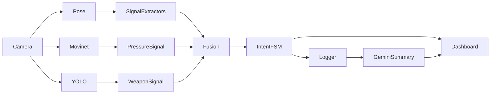

Grokking Doorway Intelligence

## Abstract

Traditional smart door cameras detect motion.  
They do not interpret intent.

This project explores a different approach to doorway intelligence: modeling micro-behavior using interpretable geometric and temporal signals rather than relying on a single black-box model. By combining pose-based kinematics, lightweight action probabilities, object detection, state-based escalation logic, and human-in-the-loop feedback, we construct a modular, explainable threat detection pipeline.

An exploratory extension investigates representing human motion as a discrete vector field and analyzing its angular and divergence dynamics. This direction remains under active experimentation.

The central premise is simple:

*We are not solving human behavior in general.  We are solving a constrained behavioral space at a doorway.*

---

## 1. Introduction

Doorways are unique environments.

They compress behavioral variability into a narrow set of actions:

- approaching
- waiting
- scanning
- pacing
- hesitating
- escalating

Despite this constraint, most commercial systems remain binary. They detect motion or faces, but do not reason about patterns.

The objective of this system was not to classify actions in a generic sense, but to construct an interpretable, preventive intelligence layer that evaluates:

- how a person is moving,
- how long they remain,
- how patterns evolve over time,
- whether escalation is occurring.

Instead of training a monolithic model to learn intent implicitly, we decompose the problem into physically meaningful signals and recombine them using transparent logic.

---

## 2. System Architecture

The system is organized as a multimodal pipeline:



Each component serves a specific interpretive role.

* Pose extraction captures geometry.
* MoViNet provides temporal behavioral pressure.
* YOLO acts as a hard override for weapon presence.
* A signal fusion layer computes a continuous intent score.
* A finite state machine governs escalation.
* A logging and dashboard system enables review and learning.

This modularity ensures that no single component dominates the system.

**Performance Characteristics:**

The pipeline processes 30 FPS on consumer-grade hardware (Intel i7 + integrated GPU):

- Pose estimation (MediaPipe): ~15ms
- MoViNet inference: ~80ms (parallel worker process)
- YOLO inference: ~120ms (parallel worker process)
- Signal fusion: <1ms

Total latency: ~150ms from capture to intent classification.

Parallel worker processes for MoViNet and YOLO ensure the main loop maintains real-time performance despite heavy inference costs.

---

## 3. What's New Here

This work differs from existing approaches in the following ways:

**1. Physics-grounded feature engineering rather than end-to-end learning**

Most systems use CNNs or transformers on raw video. We derive kinematic invariants from pose geometry—velocity, angular momentum, divergence—treating the human body as a physical system rather than a classification target.

**2. Behavioral pressure as a process variable**

MoViNet output is treated as a continuous signal with temporal derivatives, not a discrete label. This enables detection of escalation patterns (increasing violence probability) rather than just instantaneous classification.

**3. Asymmetric fusion with hard overrides**

Weapon detection bypasses soft probabilistic fusion entirely. This asymmetry reflects domain constraints: a weapon's presence is objectively verifiable and legally actionable, whereas behavioral signals are probabilistic and context-dependent. Hard overrides prevent fusion ambiguity in high-stakes scenarios.

**4. Shadow-mode online learning**

Rather than auto-updating model weights, the system generates detailed credit assignment reports for human review. Users label events as accurate or false alarms; the system computes which signals contributed to errors and proposes weight adjustments. This keeps humans in the loop while enabling personalized adaptation.

The vector field extension (§10) may represent the first application of continuum mechanics to behavioral intent classification.

---

## 4. Pose-Based Kinematic Signals

MediaPipe provides 33 normalized body landmarks per frame:

$$
p_i(t) = (x_i(t), y_i(t))
$$

From these, we derive kinematic quantities.

### 4.1 Linear Velocity

$$
\vec{v}_i(t) = \frac{p_i(t) - p_i(t-1)}{\Delta t}
$$

Speed is:

$$
|\vec{v}_i(t)|
$$

Signals are EMA-smoothed with α=0.6 for stability while preserving responsiveness.

---

### 4.2 Head Orientation and Scanning

Head angle relative to shoulder midpoint:

$$
\theta(t) = \arctan2(y_{nose} - y_{shoulder}, x_{nose} - x_{shoulder})
$$

Angular velocity:

$$
\omega(t) = \frac{\theta(t) - \theta(t-1)}{\Delta t}
$$

Repeated oscillations in ω indicate scanning behavior. We count zero-crossings with hysteresis to detect head sweeps.

---

### 4.3 Hesitation and Stop–Go Patterns

We count:

* direction reversals in centroid motion
* transitions between low and high velocity

These capture pacing and indecision.

---

### 4.4 Loitering Detection

Loitering is not "standing still."

It is prolonged presence with intermittent micro-movements.

We track three distinct loitering patterns:

- **Stationary**: Low speed, minimal displacement (standing in place)
- **Pacing**: Low net displacement, moderate speed (walking in small radius)
- **Displaced**: Intermittent movement with returns to origin

Each pattern has different ramp rates for intent scoring. Pacing is weighted most heavily as it indicates indecision or surveillance behavior.

Presence time is tracked with timeout-based reset logic (2-second absence resets the timer).

---

## 5. Behavioral Pressure via MoViNet

MoViNet is used not as a hard classifier but as a continuous pressure signal.

Given raw probability $p$:

$$
p_{pressure} = \max(0, \text{EMA}(p) - \tau) \times g
$$

Where:

* τ is a noise floor threshold (0.1)
* g is gain (2.0)

We also compute the temporal derivative:

$$
\frac{dp}{dt} \approx p(t) - p(t-1)
$$

Positive derivatives (escalating violence probability) contribute additional pressure:

$$
p_{slope} = \max(0, \frac{dp}{dt}) \times g_{slope}
$$

Final pressure:

$$
p_{total} = p_{pressure} + p_{slope}
$$

This transforms classification probability into escalation pressure, capturing not just "is violence happening" but "is violence increasing."

---

## 6. Weapon Detection as Dominant Signal

Weapon detection operates under different logic.

If a weapon class is detected with sufficient confidence and persists across 3 consecutive frames (debouncing):

Intent state is escalated aggressively, with a 20-second cooldown period.

The fusion equation (§7) includes a hard override:

$$
I_{final}(t) = \max(I_{base}(t), 0.8)
$$

when `weapon_confirmed = true`.

---

## 7. Signal Fusion

All normalized signals $s_i(t) \in [0,1]$ are combined via weighted sum:

$$
I_{base}(t) = \sum_{i} w_i s_i(t)
$$

With hard overrides for weapons and high MoViNet pressure:

$$
I_{final}(t) = \begin{cases}
\max(I_{base}, 0.8) & \text{if weapon detected} \\
\max(I_{base}, 0.45) & \text{if } p_{pressure} > 0.4 \\
\max(I_{base}, 0.65) & \text{if } p_{pressure} > 0.75 \\
I_{base} & \text{otherwise}
\end{cases}
$$

Intent $I$ is clipped to $[0,1]$ and EMA-smoothed with α=0.1 for temporal stability.

Weights $w_i$ are interpretable and tunable. Example configuration:

```
WEIGHTS = {
    "velocity": 0.04,
    "motion_E": 0.06,
    "head_yaw_rate": 0.05,
    "loitering_score": 0.25,  # Highest weight
    "movinet_pressure": 0.20,
    "hand_fidget": 0.05,
    # ... 12 more signals
}
```

---

## 8. Intent State Machine

Continuous intent is discretized into stable behavioral states:


Thresholds:
- CALM: I < 0.4
- UNUSUAL: 0.4 ≤ I < 0.6
- SUSPICIOUS: 0.6 ≤ I < 0.7
- THREAT: I ≥ 0.7

Hysteresis thresholds govern state transitions with **asymmetric dynamics**:

- **Escalation (upward)**: Immediate upon crossing threshold (better to over-alert)
- **De-escalation (downward)**: Requires sustained low intent over 5 frames (~150ms)

This asymmetry reflects operational reality: legitimate visitors often escalate 
briefly (confusion, impatience) then de-escalate naturally. Actual threats rarely 
de-escalate once committed to an action.

The bidirectionality is essential—people calm down. The hysteresis prevents 
oscillation from transient signal noise.

---

## 9. Logging and Human Feedback

Upon escalation (I ≥ 0.6 or weapon detection):

* A 60-second clip is recorded at actual capture rate
* All signals are logged with mean and max values
* Intent transitions are timestamped
* Gemini 2.0 Flash generates a human-readable summary

Language model summarization serves dual purposes:

1. **Explainability**: Provides narrative context for users reviewing events
2. **Temporal pattern detection**: Enables retrieval of low-scoring events that may form patterns over time (e.g., repeated reconnaissance visits at sub-threshold intent levels)

Summaries are indexed and searchable, converting raw logs into narrative intelligence.

### 9.1 Online Learning Mechanism

Users review events via dashboard and provide binary feedback (accurate / false alarm).

The system computes **credit assignment**: which signals deviated most from expected values during misclassifications.

For false positives, signals that were high are penalized:

$$
\Delta w_i = -\eta \cdot \text{error} \cdot s_i(t)
$$

For false negatives (missed threats), high signals are rewarded:

$$
\Delta w_i = +\eta \cdot \text{error} \cdot s_i(t)
$$

Where:
- η is learning rate (0.05)
- error is difference between user label and system prediction

Proposed weight adjustments are **logged as JSON reports** rather than applied immediately (shadow mode). This prevents the system from learning pathological patterns from sparse feedback.

After accumulating 20-50 labeled examples, an administrator reviews proposed adjustments and applies them in batch.

Example report structure:

```json
{
  "event_id": "a32171a3-0f8b-4f40-8250-a75f49297a27",
  "user_label": "false_alarm",
  "system_prediction": "SUSPICIOUS",
  "error": -0.35,
  "proposed_adjustments": {
    "loitering_score": -0.08,  // Was high during false alarm
    "hand_fidget": -0.03,
    "movinet_pressure": +0.02  // Was appropriately low
  },
  "confidence": 0.72
}
```

This approach enables **personalized adaptation** (e.g., rural households may weight loitering differently than urban apartments) while maintaining **interpretability and safety**.

---

## 10. Exploratory Direction: Vector Field Motion Modeling

An emerging extension treats the human body not as isolated landmarks, but as a discrete vector field.

Each landmark $i$ has position $\vec{p}_i(t)$ and velocity $\vec{v}_i(t)$. We define the pose as a vector field:

$$
\mathcal{F}(t) = \{\vec{p}_i(t), \vec{v}_i(t)\}_{i=1}^{33}
$$

We compute field-theoretic quantities:

### 10.1 Divergence (Expansion/Contraction)

Divergence measures whether the body is expanding or contracting:

$$
\nabla \cdot \vec{v} \approx (\vec{v}_{shoulder_R} - \vec{v}_{shoulder_L}) \cdot \hat{x} + (\vec{v}_{nose} - \vec{v}_{hip}) \cdot \hat{y}
$$

Positive divergence indicates body expansion (arms spreading, standing up).  
Negative divergence indicates contraction (crouching, defensive posture).

### 10.2 Curl (Rotation)

Curl measures rotation around the center of mass:

$$
\nabla \times \vec{v} \approx \frac{1}{N} \sum_{i=1}^{N} \frac{\vec{r}_i \times \vec{v}_i}{|\vec{r}_i|^2}
$$

where $\vec{r}_i = \vec{p}_i - \vec{p}_{COM}$ is the position relative to center of mass.

High curl magnitude indicates rapid turning or spinning motion.

### 10.3 Flow Coherence

Coherence measures how organized the motion is:

$$
C(t) = \frac{1}{N} \sum_{i=1}^{N} \frac{\vec{v}_i \cdot \vec{v}_{mean}}{|\vec{v}_i| \cdot |\vec{v}_{mean}|}
$$

Values near 1 indicate coordinated motion (all limbs moving in concert).  
Values near 0 indicate chaotic, unorganized motion (agitation, loss of composure).

### 10.4 Preliminary Observations

Testing on recorded clips reveals distinct signatures:

**Aggressive lunge:**
- ∇·v > 0.5 (body expanding forward)
- |∇×v| < 0.2 (minimal rotation, direct approach)
- C > 0.9 (highly coordinated)

**Evasive turn:**
- ∇·v ≈ 0 (volume conserving)
- |∇×v| > 1.0 (strong rotation)
- C > 0.7 (organized turning motion)

**Nervous loitering:**
- ∇·v oscillates ±0.3 (weight shifting)
- |∇×v| oscillates ±1.5 (repeated head turns)
- C ≈ 0.4 (low coherence, fidgeting)

**Calm waiting:**
- ∇·v ≈ 0
- |∇×v| ≈ 0
- C > 0.8 (stable, minimal motion)

This approach reframes motion analysis as field dynamics rather than scalar velocity accumulation. It provides **frame-invariant features** (divergence and curl are geometric invariants under rotation/translation) and captures **full-body coordination** in 4-6 summary statistics rather than 18+ individual signals.

Further experimentation is ongoing to validate whether field-theoretic features improve classification accuracy and reduce false positive rates.

---

## 11. Conclusion

The project demonstrates that constrained behavioral intelligence can be constructed through interpretable geometric signals, lightweight learned models, and state-based escalation logic.

By narrowing the domain and grounding signals in kinematics, it is possible to approximate intent without opaque reasoning.

Future work includes:

* Validation of vector field features on larger labeled datasets
* Integration of audio signals (aggression detection, glass breaking)
* Friendly face recognition with signal dampening
* Deeper exploration of temporal pattern mining across multiple visits

The system runs in production on consumer hardware, processes 30 FPS with sub-200ms latency, and has recorded events with user feedback enabling weight refinement.

> Sometimes intelligence is not about learning everything. It is about measuring the right few things well.

---

## Appendix: Implementation Notes

**Tech Stack:**
- Backend: Python (FastAPI, MediaPipe, TensorFlow Lite, ONNX Runtime)
- Frontend: React (Vite, TailwindCSS, Recharts)
- Hardware: ESP32 (PIR sensor, doorbell button, WebSocket client)
- AI Services: Google Gemini 2.0 Flash (video summarization)

**Architecture Pattern:**
- Pub/Sub message broker (FastAPI server as central hub)
- Multiprocessing for ML inference (GIL-free parallelism)
- WebSocket streaming for real-time dashboard updates
- Thread-safe shared state with mutex locks

**Code availability:**
[GitHub](https://github.com/parzi-val/doorbell-cam)

---

**Acknowledgments:**
This work was motivated by the observation that existing doorbell cameras optimize for convenience, not intelligence. Special thanks to the open-source community for MediaPipe, YOLO, and MoViNet.

- [MediaPipe Solutions](https://ai.google.dev/edge/mediapipe/solutions/guide)
- [MoViNets for Violence Detection in Live Video Streaming](https://github.com/engares/MoViNets-for-Violence-Detection-in-Live-Video-Streaming)
- [Weapons Detection-YOLOv8n](https://huggingface.co/Subh775/Threat-Detection-YOLOv8n)